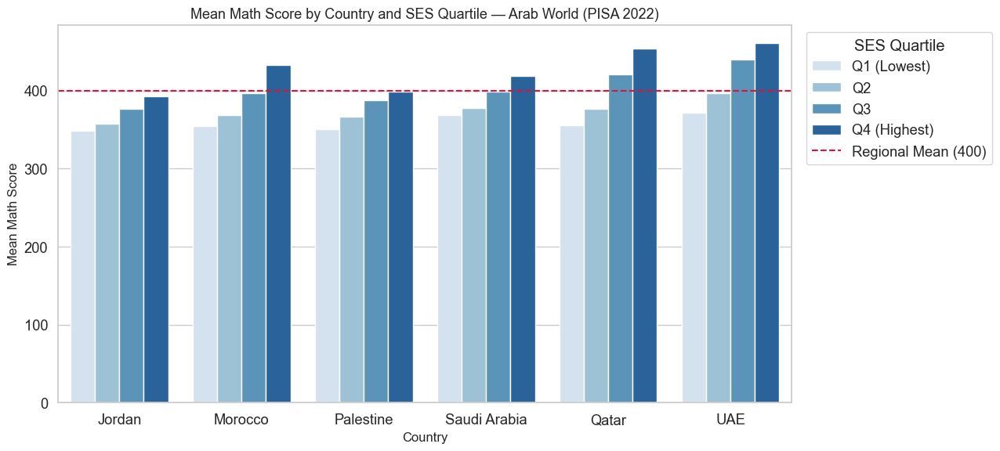
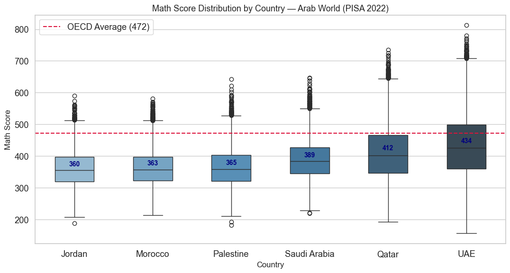
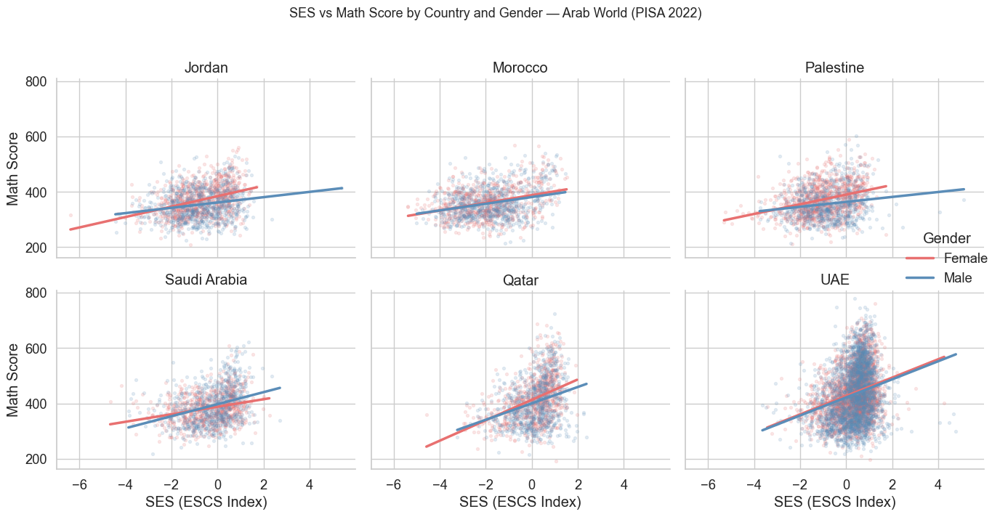
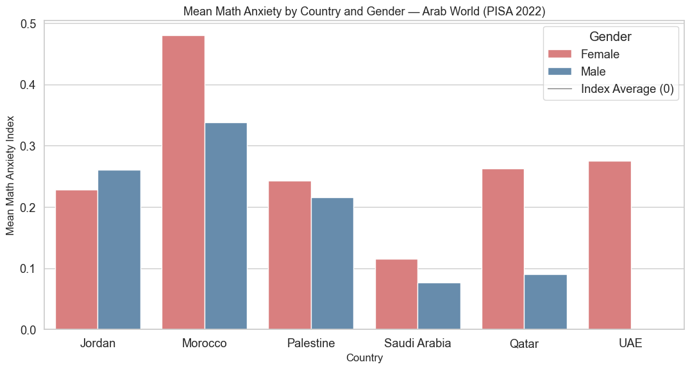

<h1 align="center">Socioeconomic and Gender Gaps in Math Performance across the Arab World</h1>

<p align="center">
  A data visualization study of <b>PISA 2022</b> — how family background, gender, and country<br>
  shape math performance among 15-year-olds in six Arab countries.
</p>

<p align="center">
  
  
  
  
  
</p>

<p align="center">
  <b>Palestine · Jordan · Morocco · Qatar · Saudi Arabia · UAE</b>
</p>

<p align="center">
  
</p>

---

## The question

PISA scores 15-year-olds in math, reading, and science every three years. Six Arab countries took part in the 2022 cycle, and all six landed below the OECD average of 472 — but a country average hides more than it reveals. The interesting question isn't *how did each country do*, it's **who inside each country did well, and who didn't**.

This project follows four threads:

1. How are math scores distributed across the six countries?
2. Is there a gender gap, and does it hold everywhere?
3. Does socioeconomic status affect boys and girls differently?
4. Which countries show the widest gap between their richest and poorest students?

The work is split in two: **Part I** explores the data openly across 11 plots; **Part II** takes the two strongest findings and turns them into an explanatory slide deck.

---

## Findings

### Every country sits below the OECD average — but not by the same margin

<p align="center">
  
</p>

The UAE (434) and Qatar (412) come closest to the OECD line; Jordan (360), Morocco (363), and Palestine (365) are furthest, with Saudi Arabia at 389. The UAE and Qatar also have visibly wider boxes — more spread inside those countries than in the others.

### The higher a country scores, the wider its internal gap

Math scores climb at every rung of the SES ladder: **Q1 = 355 → Q2 = 378 → Q3 = 421 → Q4 = 450**, roughly 95 points end to end, with the sharpest jump between Q2 and Q3.

But the gap is not the same everywhere. Qatar and the UAE — the two top scorers — show the widest internal spread (95–100 points between their poorest and richest quartiles). Jordan and Palestine have the narrowest (43–50 points), though their top-SES students still barely reach the regional mean of 400. **High average, high inequality; low average, low inequality.**

### Girls outscore boys — and gain more from higher SES

<p align="center">
  
</p>

Girls score higher in 5 of 6 countries, most clearly in Palestine (17 points) and Jordan (16 points). Saudi Arabia is the only exception. In Jordan, Qatar, and Palestine the female regression line is also steeper, meaning girls convert socioeconomic advantage into test performance more than boys do.

### They also report more math anxiety — while still scoring higher

<p align="center">
  
</p>

Girls report higher anxiety in 5 of 6 countries, most visibly in Morocco, Qatar, and the UAE — the same countries where they outperform boys. Jordan is the lone reversal. Higher anxiety and higher achievement travel together here, which complicates the usual reading of the anxiety–performance link.

---

## Repository structure

```
math-performance-inequality-arab-world/
├── notebooks/
│   ├── Part_I_PISA_Arab_Exploration.ipynb      # Exploratory analysis
│   └── Part_II_PISA_Arab_Explanatory.ipynb     # Explanatory slide deck
├── data/
│   └── pisa_arab_clean.csv                     # Cleaned dataset (61,775 × 12)
├── reports/
│   ├── Part_I_PISA_Arab_Exploration.html       # Rendered notebook
│   └── Part_II_PISA_Arab_Explanatory_slides.html
├── images/                                     # Charts used in this README
├── requirements.txt
├── .gitignore
└── README.md
```

---

## Dataset

Source: [OECD PISA 2022 Student Questionnaire](https://www.oecd.org/pisa/data/2022database/) (`CY08MSP_STU_QQQ.SAV`), read with `pyreadstat` and filtered to the six participating Arab countries. The raw `.SAV` is not committed here — it is far too large for GitHub — so `data/pisa_arab_clean.csv` is the processed extract both notebooks run on.

Mathematics was the **major domain** of the PISA 2022 cycle. PISA rotates its focus subject every three years, and in a major-domain year the assessment devotes substantially more items to that subject — so math is both the most precisely measured outcome in the data and the only subject with a dedicated anxiety construct in the student questionnaire. That is why this project analyses math rather than reading or science.

**Preparation:**
- Filtered to six country codes, kept 12 relevant columns.
- Computed `math_score` as the mean of the 10 plausible values PISA supplies per student — the standard treatment for PISA achievement data.
- Derived `ses_quartile` from the ESCS index to enable inequality comparisons.

| Column | Description |
|---|---|
| `CNT` / `country` | ISO country code and country name |
| `gender` | Male / Female |
| `immigrant_status` | Native, second-generation, first-generation |
| `math_score` | Mean of 10 plausible values — **main outcome** |
| `ses` | ESCS index of economic, social and cultural status |
| `ses_quartile` | Q1 (Lowest) – Q4 (Highest), derived from `ses` |
| `parent_edu` | Highest parental education |
| `parent_occ` | Highest parental occupational status |
| `ict_resources` | ICT resources available at home |
| `math_anxiety` | Standardized math anxiety index (WLE, centered at 0) |
| `belonging` | Sense of belonging at school |

Sample sizes are uneven — the UAE contributes 24,600 students, roughly three times any other country — so regional averages lean toward the UAE. Country-level comparisons are the safer read.

---

## Running it

```bash
git clone https://github.com/<username>/math-performance-inequality-arab-world.git
cd math-performance-inequality-arab-world
pip install -r requirements.txt
jupyter notebook
```

Regenerate the rendered outputs:

```bash
jupyter nbconvert notebooks/Part_I_PISA_Arab_Exploration.ipynb --to html --output-dir reports
jupyter nbconvert notebooks/Part_II_PISA_Arab_Explanatory.ipynb --to slides --output-dir reports
```

`pyreadstat` is included only for rebuilding the cleaned CSV from the original `.SAV`; the notebooks themselves do not need it.

---

## Built with

`pandas` · `numpy` · `matplotlib` · `seaborn` · `jupyter`

Data from the OECD Programme for International Student Assessment (PISA), 2022 cycle.

---

Completed as the final project for the **Udacity Data Analyst Nanodegree**, following the exploratory → explanatory workflow the program teaches — which is why the analysis is split across two notebooks.

---

<p align="center"><sub>by <b>Malak Battatt</b></sub></p>
